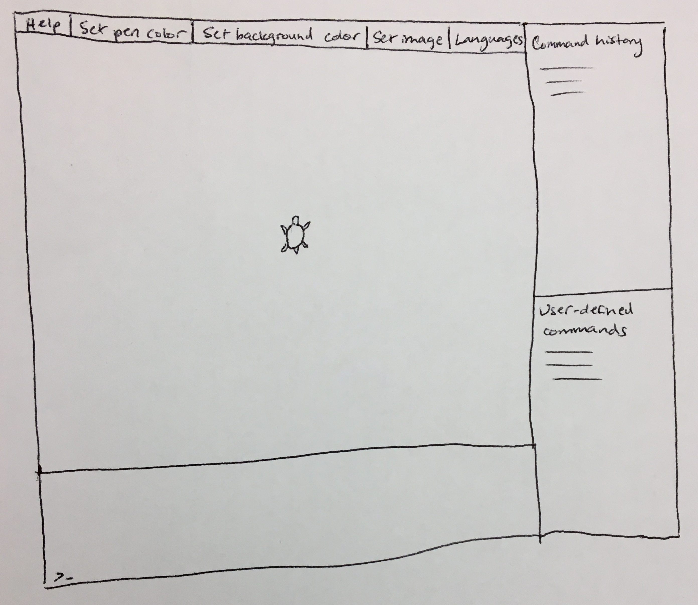

# Parser Planning Design Document

## Authors:

##Introduction

**This section describes the problem your team is trying to solve by writing this program, the primary design goals of
 the project (i.e., where is it most flexible), and the primary architecture of the design (i.e., what is closed and 
 what is open). Discuss the program at a high-level (i.e., without referencing specific classes, data structures, or 
 code).**
 
 The problem we are trying to solve is how to create a virtual program that can accept commands from the user and make 
 the turtle move and draw according to the user’s wishes. One of the design goals is to create a program that is
  flexible enough to accept a variety of commands and to make it easily expandable by adding new commands. A similar, 
  related design goal is to make the program flexible in the movements and actions of the turtle, which can be 
  controlled by the commands. This, in turn, will enable there to be a greater variety of commands that could be added. 
  In general, we want most of the implementation of the back end to be closed architecture, except those parts which 
  interact directly with the user and the front end. Similarly, we want most of the front end to be closed other than 
  the parts which are needed to interact with the user and the back end. At a high level, the implementation we are 
  considering consists of a controller that runs the main program and creates the model, which keeps track of the 
  program state and moves the turtle, and the view, which contains the UI and the display. We also plan to have a 
  parser which we envision as a separate component from the model and view, though it could later be moved if it makes 
  sense with our design as our program evolves. 
  
  ## Design Overview
 **This section serves as a map of your design for other programmers to gain a general understanding of how and why the
 program was divided up, and how the individual parts work together to provide the desired functionality. Describe the
 four APIs you intend to create (their purpose with regards to the program's functionality, and how they collaborate 
 with each other) focusing specifically on the behavior, not the internal state. Include a picture of how the 
 components are related (these pictures can be hand drawn and scanned in, created with a standard drawing program, 
 or screen shots from a UML design program). To keep these classes as flexible as possible, your team must describe
 two different implementations (i.e., data structures, file formats, etc.) and then design your method signatures so
 they do not reveal the specifics of either implementation option. Discuss specific classes, methods, and data 
 structures, but not individual lines of code.**
 
 
 
 The four APIs we intend to create are the internal backend, external backend, internal frontend, and external frontend.
 The external frontend and external backend will interact through a controller class which mediates their interactions.
 
 ### External Frontend
 It will be necessary to take an input command from the user and pass this to the controller. We envision this working 
 by having the controller create an event handler which is passed to the view as a parameter to the constructor so that 
 the controller receives the command when it is inputted by the user. The external frontend should also create a 
 drop-down menu or similar view element that allows the user to choose from a list of possible languages, and the 
 result of this selection can be saved in the controller to pass to the model for the parser to interpret the commands. 
 There should also be a method that would be called by the controller when a command has finished executing that tells 
 the view to update its state based on the results of the commands that have been run. Finally, there needs to be a 
 method for displaying any errors received by the controller. 
 
 ### Internal Frontend
 
 The frontend primarily consists of various ways the user is able to interact with the SLogo application. Examples of 
 this include the dropdown for language selection, the command terminal, run and pause simulation. The internal 
 frontend API will allow future developers to extend this interactivity, by allowing the extension of a dropdown menu 
 class to allow for more customizability by the user, add more buttons which impact the display of the visualization, 
 adding additional pages using a page interface, as well as potentially allowing the user to add more actors (turtles, 
 world boundaries etc) using the gui.
 
 ### External Backend
 The backend is composed of the model and contains the necessary functionality to parse and execute commands. Therefore, 
 the external API must consist of a method to execute a given input string which will return the new turtle location and 
 any associated paths/history. Since this also contains the parser, there needs to be a method to set resources file. 
 Any turtle instances also need to be able to call on the states of any other possible objects in the simulation in 
 order so they can adjust their command execution accordingly.
 
 ###Internal Backend
 
 Since the backend will be the part of the program that stores the state of the program, the internal API will need to 
 be able to allow the different parts of the backend to interact with each other. Therefore, the parser would need to 
 receive the command from the model to be parsed and returned back to the model. There will also need to be a method in 
 the command superclass or the subclasses where the model can call the command to be executed. There also will be a 
 method in the turtle class, which holds information about the turtle, that can be called by the model or commands to 
 update the state of the turtle.
 
##User Interface
The general goal of the user interface is to provide the user a clear development environment that allows the user to enter commands, see how the commands play out visually, and seeing which commands have already been entered. Moreover, the display should have several buttons that allow the user to change basic settings, like pen or background color, image, and language. The interface should also have a help button which provides clear instructions to the user regarding how they can interact with the environment. Finally, there should be a display which indicates user defined commands as the the user needs to be aware of which commands they have access to. 
For the help button, the user can interact with it simply by clicking on it. Upon clicking on, a help window will pop up which will display the basic information the user of the program needs to know. In regards to the pen color, upon clicking on the button, a window will pop up that has a color wheel which the user can use to select a color. The same functionality will exist for setting background color, except that instead of changing the pen color, the color wheel will change the background color. Next, the set image button will display a file picker on click which will allow the user to select a supported image type to set the background image with. The language button will work similarly to the other button, with a popup that features all supported languages for the user to select. The command history section of the GUI will display the most recent previous commands the user has entered. This screen will display the most recent command at the bottom with the older commands towards the top. Finally, the user defined commands section will display all the currently loaded user defined commands along with a little bit of information about what each of them do.
There are several situations that can occur in which the user selects bad data. The first situation in which this can occur is with the setting color option. Although JavaFX has features that allows you to implement color wheels, that does not guarantee JavaFX will support the selected color. In that case, the user will see a pop-up that alerts them that the color they chose was invalid and will be forced to select a different color. In terms of the image button, the file chooser should be setup so only supported image file types can be chosen. In the event that an image file is corrupted and ViewInterface is unable to set the image to that file, the user will be alerted with a pop-up telling them to select a valid file. Finally, the controller and parser will alert the GUI if a command entered is invalid. If that is the case, the command history section of the GUI will display the command the user typed, except in read to indicate that it was invalid.
In terms of the turtle is actually displayed, that part of the GUI will have to be dynamically rendered. Whereas the rest of the elements can just be written in FXML as they are static, the interface will need to dynamically loaded in. This can be done by having a helper class that provides the FXML with the current state display of the turtle.
The last major element of the GUI is the text box where the user can enter commands. The application will send the text entered to the parser when the user hits enter, and if the text is invalid it will alert the user in the form of red text in the command history box.

 
 
##Design Details

**This section describes each API introduced in the Overview in detail (as well as any other sub-components that may be 
needed but are not significant to include in a high-level description of the program). Describe how each API supports 
specific features given in the assignment specification, what resources it might use, how it is intended to be used, and 
how it could be extended to include additional requirements (from the assignment specification or discussed by your 
team). Finally, justify the decision to create each class introduced with respect to the design's key goals, principles, 
and abstractions. This section should go into as much detail as necessary to cover all your team wants to say.**

The design for the external frontend that we designed is important for choosing the language for SLogo commands. This 
would require properties files containing the commands, as well as any other UI elements, in different languages. 
This is useful because it can easily be extended to contain other languages and for any new commands that arise, and 
this framework could be useful if there are any other similar elements that need to be passed from the view to the 
model. Similarly, the method that updates the state of the turtle in the view would need to be passed information about 
the turtle in the model to know where to place it. This can easily be extended to include being able to draw a line 
based on the previous coordinates of the turtle if the pen is down, which is another part of the specifications. 
Similarly, it can be extended to any other things that need to be displayed in the view based on the state or actions 
of the turtle. The external frontend will also catch any errors from the running of the program, such as when an 
invalid or unparseable command has been given, and it will notify the user appropriately through a displayed message 
explaining the reason the error was encountered. This part of the design can be easily extended to any other errors 
the program might encounter by handling the various possible errors differently.
___

The internal frontend contains abstract pages class in order for the possibility of future developers to create more 
pages (different types of workspaces for the users, splash screen etc), as well as a toolbar class or object which is 
created using javafx visual grouping objects. This will contain the language selection dropdown and any other 
dropdowns or buttons that we will include that allow the user to customize the properties of their inputs and outputs. 
Additionally the toolbar will allow for setting of the background color, setting the turtle image, setting the pen 
width/color.

The internal frontend should also have the formatting for displaying of errors, and this formatting should be 
extendable to other supported error types that will be implemented. 

There are other required output boxes that display information about the simulation state to the user, such as the 
command history, variables in the environment which the user is able to update in the gui. There will again be a 
standard format for this type of output window which will receive information from the model through the controller as 
to display. Future programmers will be able to extend this class to add additional displays for the user.

Included classes: Toolbar, SLogo turtle display, Abstract classes for display windows, extended to create command 
history windows and variable windows,  Dropdown menus to be kept in the toolbar (either a listener or a dependency 
updates objects as require, Page superclass

___

The external backend will include methods that can return the current turtle location and orientation. This is 
absolutely necessary because it will allow the view to display the turtle after a command has been run. It is also 
important because it will extend with any new commands that are created because the commands will update the state of 
the turtle, and no changes will need to be made to this part of the external backend API because only the state is 
given out to the view. Additionally, the external backend needs to have the functionality to execute commands which 
are received from the controller by passing the commands to the parser. The external backend will contain a map data 
structure that will have a list of all current commands, this is used to call commands on the turtle. This is currently 
implemented by the properties file provided to us, but needs to be extended as the user creates and implements their 
own commands.

___

The internal backend will do the bulk of translating the commands into movement of the turtle. After the external 
backend receives the command from the controller and frontend, the internal backend must parse the command and call 
the relevant command subclasses. Those command classes then must act on the turtle class to update the state. This 
chain of calling classes is important to be able to extend the program to accept new commands because this allows the 
developer to only add a new command subclass and add some lines to the command properties files to be able to add a 
new command.

##API as Code

**Your APIs should be written as Java interfaces, types that cannot contain instance variables or private methods, in 
appropriate packages. These should be Java code files that compile and contain extensive comments to explain the purpose 
of each interface and each method within the interface (note this code can be generated directly from a UML diagram). 
Include any Exceptions you plan to throw because of errors that might occur within your methods. Note, this does not 
require that all of these types will remain as interfaces in the final implementation, just that the goal is for you 
to focus on each type's behavior and purpose. Also include the steps needed to complete the Use Cases below to help 
make your ideas more concrete.**

* The user types 'fd 50' in the command window, and sees the turtle move in the display window leaving a trail, and the 
command is added to the environment's history.
 Note, it is not necessary to understand exactly how parsing works in order to complete this example, just what the 
 result of parsing the command will be.
 
 The user will type the command into the input field and click run. At this point the run event handler in the 
 controller which will pass the inputted string to the model by calling runCommand(inputString). This will intern call 
 the parser and to receive the list of translated commands into the generic name as given in properties files along with 
 the argument. These will then be executed in order to pass arguments to needed commands. Finally once all commands are 
 executed, the model will return the given turtle as a non mutable version. This will be passed to view during the call 
 updateView. This will extract the turtle information and display it. 
 
 * The user sets the pen's color using the UI so subsequent lines drawn when the turtle moves use that color.
 
 The user will choose the pen color by selecting it from the toolbar. This color is kept in the view. When the pen is 
 down and the turtle location changes through some commands, the view will update the turtle’s location. When it does 
 that, it will also get the previous and current positions from the turtle and create a line that connects those 
 positions. The color of that line is set as the color that has been chosen by the user using the UI and saved in the 
 view.
 
 * User types ‘fd fd 50’ into the command window.
 
 The command is passed to the Controller, which calls the Model, which passes the command to the Parser. The Parser 
 takes the command and separates by spaces, then places the commands in a command list and the arguments in an argument 
 list. The command stack contains 2 ‘fd’ commands, and the argument stack contains ‘50’. These are then passed to the 
 Model. The Model places the commands in a command stack and the arguments in an argument stack, in order of the list. 
 A ‘fd’ is popped from the command stack, and it requires one argument, so ‘50’ is popped from the argument stack. The 
 command is run and returns 50 which is added to the argument stack, and the information updates the turtle by moving it 
 forward 50. Then, ‘fd’ is popped from the command stack, and ‘50’ is popped from the argument stack. This runs and 
 updates the turtle by moving it forward 50. Now, the stacks are empty, so the program knows that the command is done 
 running.
 
 * User types ‘cmd = fd 50’ into the command window to save the command ‘cmd’ as the command ‘fd 50’. Then after that 
 command is done running, the user types ‘cmd’ into the command window.
 
 This command is passed to the Controller, which calls the Model, which passes the command to the Parser. The Parser 
 takes the command and separates by spaces. The Parser recognizes the ‘=’ symbol as the save and checks that there is 
 only one variable before the ‘=’ and that variable is a string. If not, it throws an error. If so, we proceed by adding 
 the command to a map in the Parser class, where what comes before the ‘=’ symbol is the key and what comes after the 
 ‘=’ symbol is the value. The command runs as usual (described in use case above). When the next command ‘cmd’ is 
 received, the parser does not recognize it as a normal command. It then checks the map and finds that ‘cmd’ is a key in 
 there and obtains its value. It replaces ‘cmd’ with ‘fd 50’ in the original command string that it was passed. It then 
 parses that command as normal.
 
 * TurtleInterface moves off screen:
 
 Only the view would know if the turtle has moved off the display screen. So, when view is called to update, it would 
 call internal methods to determine its new location. If the the pen was down, it would call either a class or method 
 to create the line based on turtle history. This method deals with the looping of the world if that is our 
 implementation. 
 
 * User Types unknown command: 
 
 When the user clicks the run button, the input string is passed to the model and then to the parser. The parser will be 
 the first to discover the given command does not exist in its library. So, it throws a CommandNotFound exception with 
 the message containing the string the threw the error. 
  
 This exception is caught in the controller which then passed the message to the view to display. Eventually, we could 
 make it so the specific command that was mistyped is highlighted in the input box. 

* Use case: User types fd XXX where XXX is a number larger than the screen size. 

Depending on the actors present in the world (turtles and world boundary locations), the turtle has internal methods 
which call on the positions of all other actors to see if there are collisions that occur. In the case of a finite 
world, the world is loaded up with wall objects that have associated dimensions that the turtle calls upon to see if 
its coordinates intersect with the wall coordinates. The command execution and turtle position is either modified or 
terminated, and the status of the command is set which is made available to the model, then the controller, and then 
can be displayed to the user in the view. The collision information is passed onto the specific command class to modify 
or halt the execution of the command. In the case of an infinite or toroidal world, the view is responsible for updating 
the turtles location if the turtle is to be moving past the screen boundaries.

* Use case:  Model passes command inappropriate input

If a command is passed an inappropriate input, it will first check to see that the input is acceptable. Either way the 
status of the command will be updated either to running, complete, or cannot execute. This will then be passed up to 
the model and then to the controller to be displayed to the user.

##Design Considerations

**This section describes any issues which need to be addressed or resolved before attempting to devise a complete 
design solution. Include any design decisions that the group discussed at length and describe at least one alternative 
in detail (including pros and cons from all sides of the discussion). Describe any assumptions or dependencies 
regarding the program that impact the overall design. This section should go into as much detail as necessary to cover 
all your team wants to say.**

The first design consideration we encountered  was whether or not we wanted to go ahead implementing this project with 
or without a controller. A controller is able to streamline data flow and make it more intuitive, but it also makes it 
so that information must flow through multiple channels rather than a Model ViewInterface design. The model view design will not 
be as streamlined, but the data flow is more direct. We decided to go forward with the controller design in order to 
make the whole design architecture more intuitive to future developers.

One of our biggest design challenges was how to create the flow communication between the ViewInterface and the Controller. Our 
current devised method is to have the event handlers be created held in the controller essentially handling the view to 
controller direction of communication. However, this design might not be the most flexible at handling future features. 
Another design we considered was forgoing the controller altogether because this design would uncomplicate the need for 
any type of communication between the view and controller, but we decided against this for the reasons stated in the 
previous paragraph. We felt that the controller design worked better with our goals, so we resolved to find a design 
that would still incorporate a controller.

##Team Responsibilities 

Sebastian: Main, Controller, Front End

Connor: Main, Controller, Asst Front End

Olga: Commands (including sub-classes), TurtleInterface

Avivah: Parser, General Model class 
